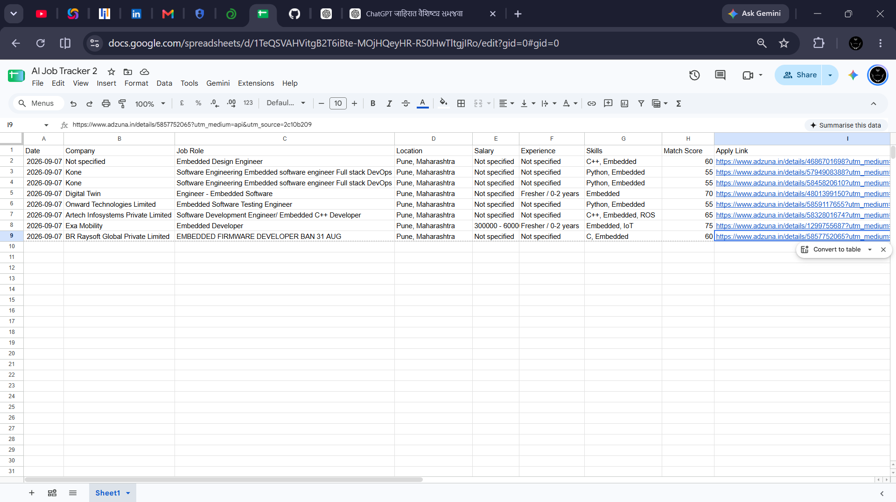

# AI Job Tracker – V1 🚀

> An automated job discovery and tracking system for entry-level Embedded, AI, IoT and Robotics opportunities.

AI Job Tracker is a Python-based automation project that searches job listings, filters them according to predefined career criteria, calculates a relevance score, detects duplicate entries, and stores suitable opportunities in Google Sheets.

The V1 version focuses on entry-level engineering opportunities, with priority given to Pune and remote opportunities in India.

---

## 📌 Project Overview

Finding relevant engineering jobs manually across multiple job portals can be repetitive, time-consuming, and difficult to track.

This project automates the initial job-search workflow by combining:

- Job API integration
- Python-based data processing
- Role and experience filtering
- Skill-based relevance scoring
- Duplicate detection
- Google Sheets tracking
- GitHub Actions automation

The goal is to reduce repetitive job-search work and create a structured personal job-tracking pipeline.

---

## 🎯 Problem Statement

Manual job searching creates several challenges:

- Searching for jobs repeatedly every day
- Filtering irrelevant senior-level positions
- Checking whether a job matches relevant skills
- Tracking previously found opportunities
- Maintaining a structured application list
- Avoiding duplicate job entries

AI Job Tracker addresses these problems by automating the initial discovery and filtering process.

---

## 💡 Solution

The V1 pipeline performs the following steps:

1. Fetch job listings using the Adzuna Job API.
2. Process the returned job data using Python.
3. Identify relevant engineering roles.
4. Filter out senior and higher-experience positions.
5. Prioritize Pune and remote opportunities.
6. Identify relevant technical skills.
7. Calculate a Match Score.
8. Check existing Google Sheets entries to avoid duplicates.
9. Store new opportunities in Google Sheets.
10. Execute the workflow automatically using GitHub Actions.

---

## 🎯 Target Roles

V1 focuses on:

- Embedded Engineer
- Embedded AI Engineer
- IoT Engineer
- Robotics Engineer

The filtering logic can also identify related entry-level titles such as:

- Embedded Software Engineer
- Firmware Engineer
- Junior Embedded Engineer
- Embedded Systems Engineer

---

## 📍 Target Location

### Primary Focus

- Pune, Maharashtra
- Remote opportunities in India

### Experience Focus

- Fresher
- 0–2 years experience

The filtering logic excludes higher-experience positions such as:

- Senior
- Sr.
- Lead
- Manager
- Principal
- Architect
- Director
- 3+ years and above

---

## 🧠 Match Scoring

The system calculates a relevance score based on job information.

The scoring logic considers factors such as:

- Entry-level / fresher relevance
- C / C++ skills
- Python
- Embedded Systems
- ESP32 / STM32
- IoT
- Robotics

Jobs below the configured relevance threshold are not added to the tracking sheet.

This provides a simple rule-based ranking mechanism for prioritizing job opportunities.

---

## 🔄 System Architecture

```text
              Adzuna Job API
                     ↓
              Python Script
                     ↓
             Job Data Processing
                     ↓
               Job Filtering
                     ↓
              Match Scoring
                     ↓
              Duplicate Check
                     ↓
               Google Sheets
                     ↑
                     |
             GitHub Actions
                     ↓
          Automated Execution
```

---

## ⚙️ Key Features

### 🔎 Automated Job Search

Fetches job listings through the Adzuna Job API.

### 🎯 Smart Job Filtering

Filters opportunities according to:

- Target roles
- Location
- Experience level
- Technical relevance

### 📊 Match Scoring

Calculates a relevance score based on predefined technical and career criteria.

### ♻️ Duplicate Detection

Checks existing job entries using the application link before adding a new opportunity.

### 📋 Google Sheets Tracking

Stores job information in a structured format.

Tracked fields include:

| Field | Description |
|---|---|
| Date | Date the job was added |
| Company | Company name when available |
| Job Role | Job title |
| Location | Job location |
| Salary | Salary information when available |
| Experience | Experience requirement |
| Skills | Relevant technical skills |
| Match Score | Calculated relevance score |
| Apply Link | Job application / source link |
| Status | Application tracking status |

### 🤖 Automated Execution

GitHub Actions executes the Python workflow automatically according to the configured schedule.

---

## 🛠️ Tech Stack

| Technology | Purpose |
|---|---|
| Python | Data processing and automation |
| Adzuna Job API | Job data source |
| Google Sheets | Job tracking and storage |
| GitHub Actions | Workflow automation |
| GitHub | Source code and project management |

---

## 📂 Project Structure

```text
AI-Job-Tracker/
│
├── .github/
│   └── workflows/
│       └── main.yml
│
├── 1.png
├── 2.png
├── 3.png
├── project-architecture.png
│
├── job_tracker.py
└── README.md
```

---

## 🔐 Security

API credentials and Google Service Account credentials are stored securely using GitHub Actions Secrets.

Sensitive credentials are not stored directly inside the source code.

Required secrets include:

```text
ADZUNA_APP_ID
ADZUNA_APP_KEY
GOOGLE_SERVICE_ACCOUNT_JSON
```

---

## 📸 Project Screenshots

### 🏗️ System Architecture


### 1. GitHub Repository


### 2. GitHub Actions – Successful Run


### 3. Google Sheets – Job Data


### 4. Google Sheets – Job Data



---

## 📈 V1 Status

### ✅ Completed

- Adzuna API integration
- Python job-processing pipeline
- Role filtering
- Experience filtering
- Skill detection
- Match scoring
- Duplicate checking
- Google Sheets integration
- GitHub Actions integration
- Automated workflow execution
- GitHub project documentation

V1 is currently functional as a personal job-discovery and tracking system.

---

## 🚀 Future Improvements – V2

Planned improvements include:

- Multiple job sources
- Improved company information extraction
- Better job relevance scoring
- AI-based resume-to-job matching
- Resume keyword analysis
- Email notifications
- Telegram notifications
- Web dashboard
- Application status analytics
- Advanced job recommendation system

The architecture is designed so additional job sources and intelligent matching features can be added in future versions.

---

## 🎓 Learning Outcomes

This project provided practical experience with:

- REST API integration
- Python automation
- JSON data processing
- Regular expressions
- Data filtering
- Rule-based scoring
- Google APIs
- Google Sheets automation
- GitHub Actions
- Secrets management
- Workflow automation
- Project documentation

---

## 👨‍💻 Author

**Akash Dukare**

ENTC Engineering Student

Interested in:

- Embedded Systems
- Embedded AI
- Edge AI
- IoT
- Robotics
- Automation

---

## ⭐ Project Goal

> Automate repetitive job discovery, identify relevant opportunities, and maintain a structured job-tracking workflow.

**AI Job Tracker V1 — Automate the Search. Focus on the Opportunity. 🚀**
