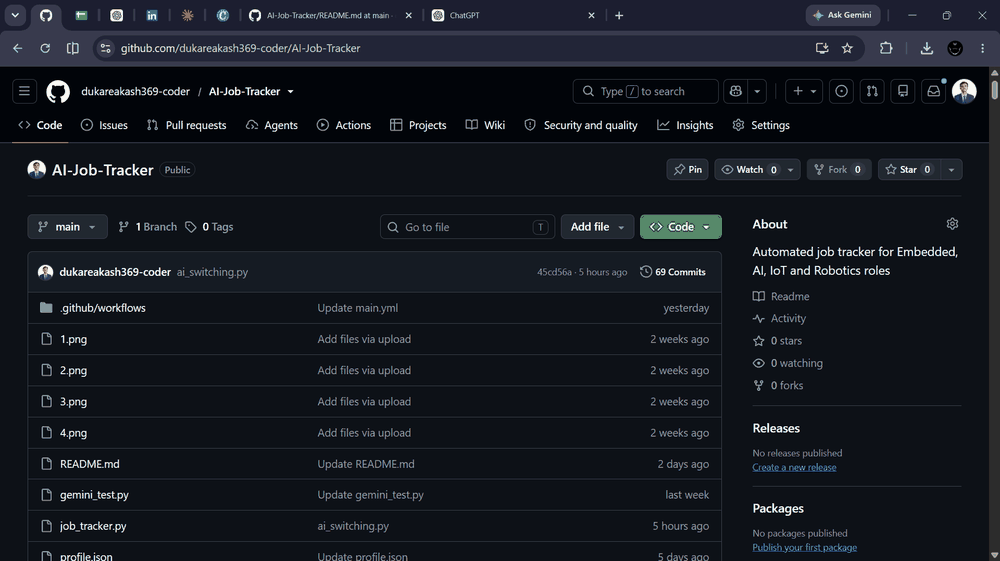
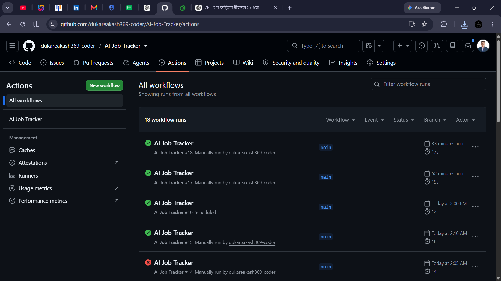
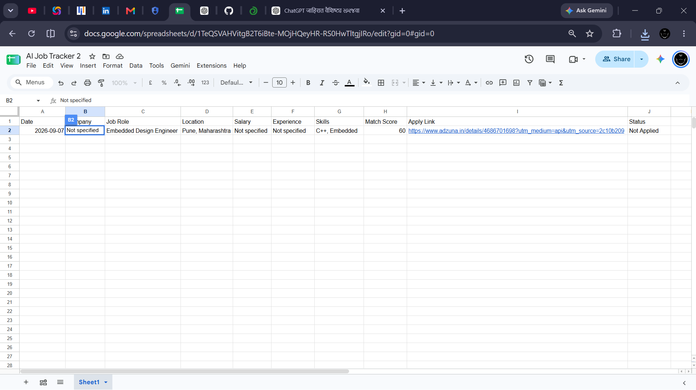

# AI Job Tracker – V1 🚀

An automated job tracking system for Embedded, AI, IoT and Robotics opportunities.

## 📌 Project Overview

Finding relevant engineering jobs manually across multiple job portals can be time-consuming.

AI Job Tracker automates the process of searching for relevant jobs, filtering them based on predefined criteria, calculating a match score, and storing the results in Google Sheets.

The system is designed with a focus on entry-level opportunities in Embedded Systems, AI, IoT and Robotics.

---

## 🎯 Problem Statement

Manually searching for relevant jobs on multiple platforms every day is:

- Time-consuming
- Repetitive
- Difficult to track
- Difficult to filter according to skills and experience

This project aims to automate this process.

---

## 💡 Solution

AI Job Tracker uses a Python automation pipeline to:

1. Fetch job listings using the Adzuna Job API.
2. Filter jobs according to relevant roles and experience.
3. Prioritize Pune opportunities.
4. Identify relevant technical skills.
5. Calculate a job Match Score.
6. Avoid duplicate job entries.
7. Store the results in Google Sheets.
8. Run automatically using GitHub Actions.

---

## 🎯 Target Roles

The current V1 focuses on:

- Embedded Engineer
- Embedded AI Engineer
- IoT Engineer
- Robotics Engineer

Relevant entry-level titles such as Embedded Software Engineer and Firmware Engineer may also be identified based on job data and filtering logic.

---

## 📍 Target Location

Primary focus:

- Pune, Maharashtra
- Remote opportunities in India

Experience focus:

- Fresher
- 0–2 years

The filtering logic excludes senior-level roles such as Senior, Lead, Manager and other higher-experience positions.

---

## 🏗️ System Architecture

```text
Adzuna Job API
       ↓
Python Script
       ↓
Job Data Processing
       ↓
Job Filtering
       ↓
Match Scoring
       ↓
Duplicate Check
       ↓
Google Sheets
       
GitHub Actions
       ↓
Automated Scheduled Execution

---

## 📸 Project Screenshots

### 1. GitHub Repository



### 2. GitHub Actions – Successful Run



### 3. Google Sheets – Job Data


