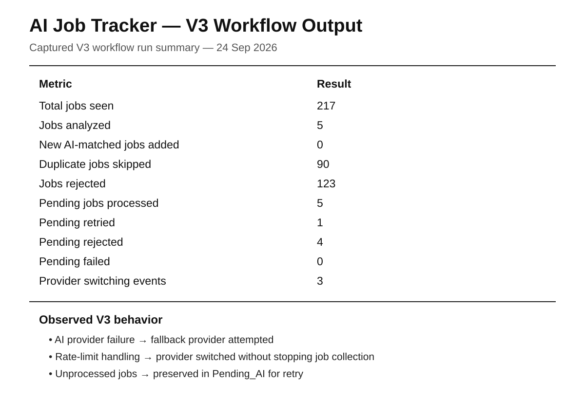

# AI Job Tracker 🚀

> **Automated AI-powered job discovery, matching, tracking, and retry/recovery system for entry-level Embedded, Embedded AI, Edge AI, IoT, and Robotics roles.**

AI Job Tracker started as a rule-based job-search automation and evolved into a **V3 persistent, AI-assisted processing pipeline**.

The system discovers relevant job listings, applies deterministic filtering and duplicate protection, compares suitable jobs with a candidate profile using AI, validates the result, and stores qualified opportunities in **Google Sheets**.

---

## 📌 Project Overview

Manual job searching requires repeatedly:

- Searching job listings
- Removing senior-level and unsuitable roles
- Comparing job requirements with personal skills
- Checking for duplicate opportunities
- Tracking useful jobs
- Handling temporary AI-processing failures

AI Job Tracker automates this initial workflow while keeping the final application decision with the candidate.

### Current V3 pipeline

```text
                    JOB DISCOVERY
                         ↓
                 Job Data Source
                         ↓
                Initial Filtering
                         ↓
                 Duplicate Check
                         ↓
              ┌──────────┴──────────┐
              ↓                     ↓
        Pending Jobs             New Jobs
              ↓                     ↓
              └──────────┬──────────┘
                         ↓
                     AI ROUTER
                   ↙     ↓      ↘
              Primary  Fallback  Fallback
                AI        AI        AI
                   ↘     ↓      ↙
                     AI RESULT
                         ↓
                     Validation
                         ↓
              ┌──────────┴──────────┐
              ↓                     ↓
          COMPLETED                RETRY
              ↓                     ↓
           Sheet1              Pending_AI
                                      ↓
                                Max Retries
                                      ↓
                                 Failed_AI
```

---

# 🎯 Target Roles

The candidate profile currently targets:

- Embedded Engineer
- Embedded Software Engineer
- Embedded Systems Engineer
- Firmware Engineer
- Junior Embedded Engineer
- Embedded AI Engineer
- Edge AI Engineer
- IoT Engineer
- Junior IoT Engineer
- Robotics Engineer
- Junior Robotics Engineer

### Preferred locations

- Pune, Maharashtra
- Remote opportunities

### Experience focus

- Fresher / Entry Level
- 0–2 years

Higher-level roles are filtered using title, experience information, and job-description checks.

---

# 🧠 AI Job Matching

The AI layer compares a discovered job with the candidate profile and produces structured information:

| Output | Purpose |
|---|---|
| Match Score | Overall job-to-profile relevance |
| Matched Skills | Skills explicitly supported by the job |
| Missing Skills | Relevant requirements not present in the profile |
| Experience Match | Compatibility with the candidate's experience level |
| Match Reason | Explanation for the generated result |

The current minimum score for adding a qualified job to **Sheet1** is configured in the project.

AI is used to enrich and evaluate suitable jobs; deterministic filtering remains responsible for initial job eligibility.

---

# 🏗️ V1 → V2 → V2.4 → V3 Evolution

## V1 — Rule-Based Automation

The first version used:

- Job listing data
- Python filtering
- Role filtering
- Experience filtering
- Rule-based skill relevance
- Match scoring
- Duplicate detection
- Google Sheets
- GitHub Actions

```text
Job Data
   ↓
Python
   ↓
Filtering
   ↓
Rule-Based Score
   ↓
Duplicate Check
   ↓
Google Sheets
```

---

## V2 — AI-Assisted Matching 🤖

V2 introduced AI-based candidate/job comparison.

```text
Job Data
   ↓
Python Filtering
   ↓
Duplicate Check
   ↓
AI Analysis
   ↓
Candidate Profile Comparison
   ↓
Match Score + Skills + Experience
   ↓
Google Sheets
```

### V2 AI output

- Match Score
- Matched Skills
- Missing Skills
- Experience Match
- Match Reason

---

## V2.4 — Grounded AI Matching

V2.4 improved the reliability of AI-generated results.

### Skill grounding

A candidate skill is treated as matched only when the job explicitly mentions or clearly requires/uses that skill or an unambiguous equivalent.

This prevents the system from assuming that a technology is used simply because it is present in the candidate profile.

### Pending_AI queue

When a job is discovered but AI processing cannot be completed, the job is preserved instead of being silently lost.

```text
Job Found
    ↓
Initial Filtering
    ↓
AI Processing
    ↓
AI unavailable
    ↓
Pending_AI
```

---

# 🚀 V3 — Persistent Queue + AI Provider Switching

V3 upgrades the Pending_AI mechanism into a **persistent processing queue**.

### Main V3 features

- Persistent Pending_AI queue
- Retry and backoff
- Stale PROCESSING recovery
- AI provider health tracking
- Automatic provider switching
- Failed_AI dead-letter queue
- Attempt history
- Maximum retry protection
- AI processing limits
- Duplicate protection
- Google Sheets verification
- Safe deterministic test harness

---

# 🔄 V3 Job Lifecycle

A job can move through the following states:

```text
PENDING
   ↓
PROCESSING
   ↓
COMPLETED
```

If AI processing fails:

```text
PROCESSING
   ↓
RETRY
   ↓
PROCESSING
```

If a job is unsuitable:

```text
PROCESSING
   ↓
REJECTED
```

If the maximum retry count is exhausted:

```text
PROCESSING
   ↓
FAILED
   ↓
Failed_AI
```

This makes the workflow persistent instead of depending on a single successful run.

---

# 🤖 AI Provider Router

V3 supports multiple AI providers through a fallback routing layer.

```text
                 AI ROUTER
                     │
             ┌───────┼────────┐
             ↓       ↓        ↓
          Primary  Fallback  Fallback
             AI       AI        AI
             │       │        │
             └───────┼────────┘
                     ↓
                 AI Result
```

When the active provider returns a temporary failure or rate-limit response, the router can switch to another available provider without stopping the complete workflow.

Provider names, API endpoints, model identifiers, quotas, and credentials are intentionally **not documented in this public README**.

---

# 📊 Persistent Provider State

V3 stores provider usage and health information in the **AI_Provider_State** worksheet.

| Field | Purpose |
|---|---|
| Provider | AI provider identifier |
| Quota Day | Date associated with usage state |
| Calls Used | Locally tracked calls |
| Daily Budget | Configured routing budget |
| Status | Provider health state |
| Last Event | Latest provider event |
| Updated At | State update timestamp |

The stored state allows provider-routing information to survive between automated runs.

> **Note:** Local budget values are routing controls. They do not represent an external provider's actual remaining quota.

---

# ⏳ Pending_AI Queue

The **Pending_AI** worksheet stores jobs that require later processing.

### Current schema

| Column | Field |
|---|---|
| A | Job ID |
| B | Date Added |
| C | Company |
| D | Job Role |
| E | Location |
| F | Salary |
| G | Experience |
| H | Description |
| I | Apply Link |
| J | Status |
| K | Failure Reason |
| L | Retry Count |
| M | Last Attempt |
| N | Next Retry |
| O | Last Provider |
| P | Attempt History |

### Retry backoff

```text
Retry 1 → 5 minutes
Retry 2 → 15 minutes
Retry 3 → 60 minutes
```

Maximum retries are limited by the project configuration.

---

# ☠️ Failed_AI — Dead-Letter Queue

Jobs that cannot be processed successfully after the configured retry limit are moved to **Failed_AI**.

This prevents permanently failing jobs from repeatedly consuming processing capacity.

```text
Pending_AI
    ↓
Retry
    ↓
Retry
    ↓
Retry
    ↓
Failed_AI
```

---

# 📋 Google Sheets

The system uses Google Sheets as the persistent tracking layer.

## Sheet1

Qualified and successfully processed jobs are stored with:

| Field | Description |
|---|---|
| Date | Date added |
| Company | Company name |
| Job Role | Job title |
| Location | Job location |
| Salary | Salary information |
| Experience | Experience requirement |
| Skills | Job skills |
| Match Score | AI match score |
| Apply Link | Application/source link |
| Status | Application tracking status |
| Matched Skills | Supported matching skills |
| Missing Skills | Relevant missing skills |
| Experience Match | Experience compatibility |
| Match Reason | AI explanation |

Application status values include:

- Not Applied
- Applied
- Interview
- Selected
- Rejected

---

# ⚙️ GitHub Actions Automation

The workflow runs automatically through GitHub Actions and can also be started manually.

### Execution flow

```text
GitHub Actions
      ↓
Checkout Repository
      ↓
Python Environment
      ↓
Dependency Installation
      ↓
AI Connectivity Test
      ↓
Run job_tracker.py
      ↓
Job Discovery → AI Router → Google Sheets
```

---

# 🛠️ Technology Stack

| Technology | Purpose |
|---|---|
| Python | Main automation and processing |
| Job Listing API | Job discovery |
| AI Services | Candidate/job analysis |
| Google Sheets | Persistent job storage |
| GitHub Actions | Scheduled automation |
| GitHub | Source control |
| JSON | Candidate profile and structured data |
| REST APIs | External service integration |

---

# 📂 Project Structure

```text
AI-Job-Tracker/
│
├── .github/
│   └── workflows/
│       └── main.yml
│
├── job_tracker.py
├── gemini_test.py
├── profile.json
├── README.md
│
├── 1.png
├── 2.png
├── 3.png
└── 4.png
```

---

# 🔐 Security

Sensitive implementation details are intentionally kept out of the public documentation.

Credentials and service-account information are stored using **GitHub Actions Secrets** rather than hard-coded in the source code.

The public README does **not** contain:

- API keys
- Service-account credentials
- Spreadsheet IDs
- Private endpoints
- Provider quotas
- Provider model identifiers
- Authentication tokens
- Other credential values

---

# 🧪 V3 Testing

V3 includes a safe deterministic test harness that is disabled by default.

The test harness can validate important queue behavior without relying on real job discovery or real AI responses.

### Test scenarios

- `pending_to_sheet1`
- `failed_ai`
- `crash_recovery`

The test harness checks behaviors such as:

- Pending job completion
- Failed job movement to Failed_AI
- Recovery of stale PROCESSING jobs
- Queue state transitions

Production behavior remains unchanged when test mode is disabled.

---

# 📈 Final V3 Workflow Output

The following is the **actual observed V3 workflow run summary**, rather than the older V1 output.



### Observed run statistics

| Metric | Result |
|---|---:|
| Total jobs seen | 217 |
| Jobs analyzed | 5 |
| New AI-matched jobs added | 0 |
| Duplicate jobs skipped | 90 |
| Jobs rejected | 123 |
| Pending jobs processed | 5 |
| Pending completed | 0 |
| Pending retried | 1 |
| Pending rejected | 4 |
| Pending failed | 0 |
| Provider switching events | 3 |

### Observed V3 behavior

```text
AI provider failure
       ↓
Fallback provider
       ↓
Successful processing OR next fallback
       ↓
If processing still unavailable
       ↓
Pending_AI
       ↓
Retry / Backoff
```

This run demonstrated the intended **provider switching, persistent queue, retry, and failure-handling behavior**.

> The run produced 0 new qualified Sheet1 additions because the analyzed jobs in that run did not satisfy the configured qualification threshold. This is an observed run result, not a fabricated success example.

---

# 📸 Project Documentation

The README now documents the **V3 workflow output** above instead of presenting the older V1 output as the final result.

The V3 architecture and processing lifecycle are represented directly in this README so that the documentation remains aligned with the current implementation.

---

# 📚 Learning Outcomes

This project provides practical experience with:

- Python automation
- REST API integration
- JSON processing
- Data filtering
- Rule-based scoring
- AI-assisted matching
- Prompt engineering
- Structured AI output
- Google Sheets integration
- GitHub Actions
- Secrets management
- Retry/backoff systems
- Queue-based processing
- Failure recovery
- Multi-provider AI routing
- Persistent state management
- Embedded/AI job-domain filtering

---

# 🔮 Future Scope — V4

V4 is planned as a future extension and is **not part of the current V3 implementation**.

Possible V4 features:

- Web dashboard
- Job analytics
- Search and filtering UI
- Match-score visualization
- Provider health dashboard
- Pending/failed queue monitoring
- Application analytics
- Notification system
- User-configurable job preferences

---

# 👨‍💻 Author

**Akash Dukare**

Electronics & Telecommunication Engineering

Interested in:

- Embedded Systems
- Embedded AI
- Edge AI
- IoT
- Robotics
- Automation

---

# ⭐ Project Goal

> **Automate repetitive job discovery, compare opportunities with a candidate profile, preserve jobs during temporary failures, and maintain a structured job-tracking workflow.**

---

## 📌 Current Version

```text
V3 — Persistent Queue + AI Provider Switching + Retry/Recovery
```

**Automate the Search. Understand the Match. Track the Opportunity. 🚀**
